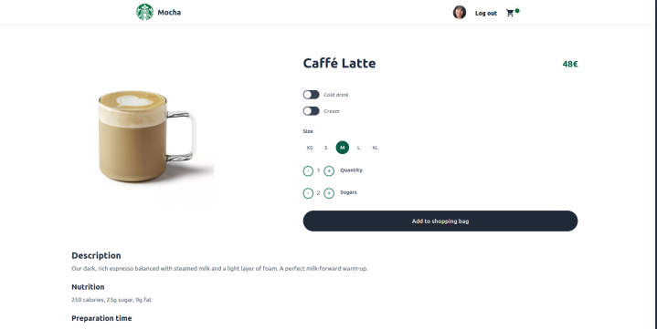
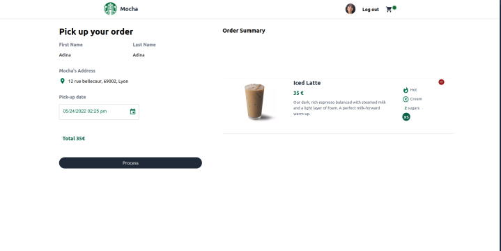
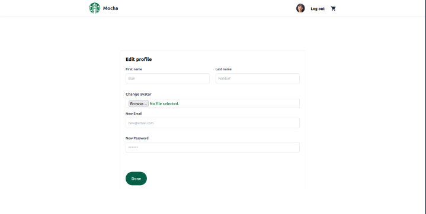
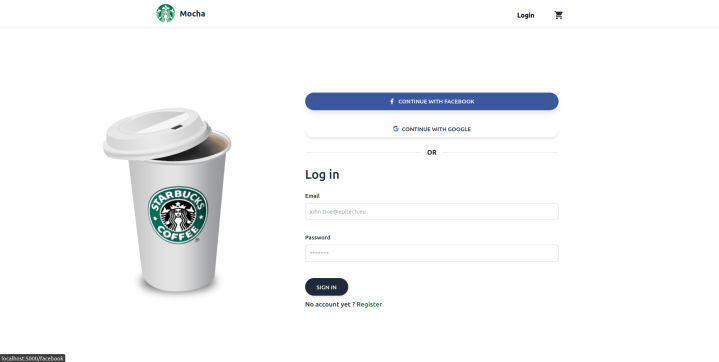

# Mocha

Oauth with Facebook and Google.






```bash
sudo docker-compose up --build
```

Then go to http://localhost:3000/.

The subject mentioned that the application is mobile, since I didn't had the equipment I did a web application that is mobile friendly instead.
